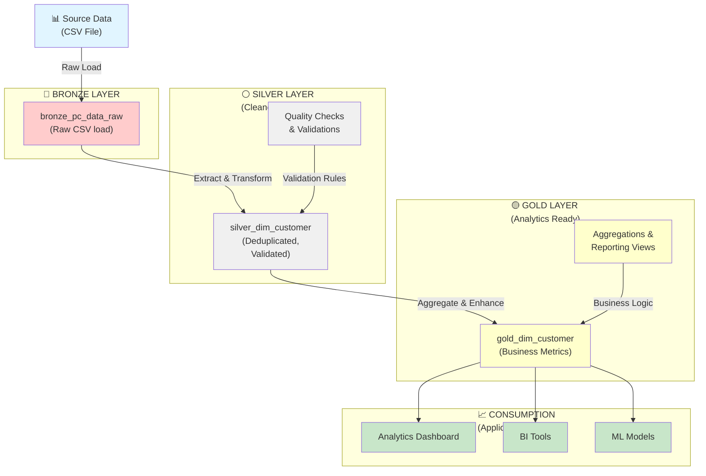
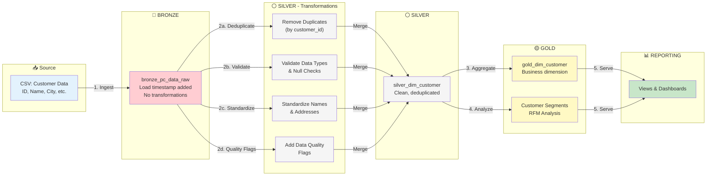
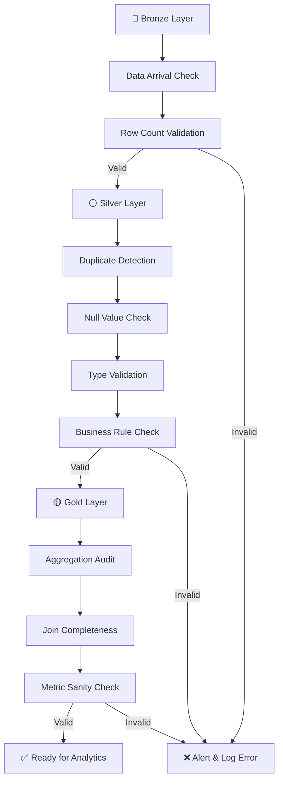

# Medallion Architecture Implementation
## PC Data Warehouse - dim_customer Example

This document describes how to refactor the current PC Data Modelling project using the **Medallion Architecture** (also called Medallion Lakehouse), using the `dim_customer` dimension table as a practical example.

---

## Table of Contents

1. [Overview](#overview)
2. [Medallion Architecture Layers](#medallion-architecture-layers)
3. [Architecture Diagram](#architecture-diagram)
4. [Data Flow for dim_customer](#data-flow-for-dim_customer)
5. [Implementation by Layer](#implementation-by-layer)
6. [Benefits](#benefits)
7. [Migration Strategy](#migration-strategy)

---

## Overview

The **Medallion Architecture** is a best-practice data organization pattern that divides data into three distinct zones:

- **Bronze Layer** - Raw, unprocessed data (source-aligned)
- **Silver Layer** - Cleaned, validated, deduplicated data (business-aligned)
- **Gold Layer** - Aggregated, business-ready data (application-optimized)

This architecture promotes data quality, traceability, and maintainability while supporting incremental transformations.

---

## Medallion Architecture Layers

### 🔴 Bronze Layer (Raw Data)
- **Purpose:** Capture raw data as-is from source systems
- **Quality:** Minimal transformations, preserves source structure
- **Retention:** High (for auditing and reprocessing)
- **Updates:** Append-only or full refresh pattern
- **Example:** Raw PC sales CSV loaded into `bronze_pc_data_raw`

### ⚪ Silver Layer (Cleaned Data)
- **Purpose:** Data cleaning, validation, and business rule application
- **Quality:** Deduplicated, validated against business rules
- **Retention:** Medium (for debugging and data lineage)
- **Updates:** Slowly changing dimensions (SCD) logic applied
- **Example:** `silver_dim_customer` with validated, unique customer records

### 🟡 Gold Layer (Analytics Ready)
- **Purpose:** Aggregated, business-ready data for analytics and reporting
- **Quality:** Optimized for performance and consumption
- **Retention:** Typically high (performance layer)
- **Updates:** Aggregations and joins for reporting
- **Example:** `gold_dim_customer` with business metrics and latest valid records

---

## Architecture Diagram



---

## Data Flow for dim_customer

### Complete Transformation Pipeline



---

## Implementation by Layer

### Layer 1: Bronze Layer (Raw Data)

**Purpose:** Store raw data exactly as received from the source system.

#### Bronze Table: `bronze_pc_data_raw`

```sql
-- Step 1: Create Bronze Database
CREATE DATABASE pc_data_bronze;
GO

-- Step 2: Create Bronze Table (mirrors CSV structure)
USE pc_data_bronze;
GO

CREATE TABLE bronze_pc_data_raw (
    -- Source columns (as-is from CSV)
    id INT,
    customer_name NVARCHAR(255),
    city NVARCHAR(100),
    country NVARCHAR(100),
    email NVARCHAR(255),
    phone NVARCHAR(20),
    -- Additional columns from the full dataset
    pc_model NVARCHAR(100),
    sale_price DECIMAL(10, 2),
    cost_price DECIMAL(10, 2),
    sale_date DATE,
    
    -- Bronze layer metadata
    load_timestamp DATETIME DEFAULT GETDATE(),
    source_file NVARCHAR(255),
    load_id INT
);

-- Step 3: Load Raw Data (simple BULK INSERT or COPY FROM CSV)
-- In practice, this would be done via Azure Data Factory, 
-- Python/Spark, or SQL Server BULK INSERT

BULK INSERT bronze_pc_data_raw
FROM 'C:\path\to\1772542271737_pc_data (2).csv'
WITH (
    FIELDTERMINATOR = ',',
    ROWTERMINATOR = '\n',
    FIRSTROW = 2,
    TABLOCK
);
```

#### Bronze Layer Characteristics:
- ✅ **Raw structure:** Columns map directly to CSV
- ✅ **No transformations:** Data is stored as-is
- ✅ **Traceability:** `load_timestamp` and `load_id` for audit trail
- ✅ **Append-only:** Supports full refresh pattern

---

### Layer 2: Silver Layer (Cleaned & Validated Data)

**Purpose:** Apply business rules, data quality checks, and transformations.

#### Silver Table: `silver_dim_customer`

```sql
-- Step 1: Create Silver Database
CREATE DATABASE pc_data_silver;
GO

-- Step 2: Create Silver Dimension Table
USE pc_data_silver;
GO

CREATE TABLE silver_dim_customer (
    -- Customer Key (created in silver)
    customer_key INT PRIMARY KEY IDENTITY(1,1),
    
    -- Customer Business Attributes
    customer_id INT NOT NULL UNIQUE,
    customer_name NVARCHAR(255) NOT NULL,
    city NVARCHAR(100),
    country NVARCHAR(100),
    email NVARCHAR(255),
    phone NVARCHAR(20),
    
    -- Data Quality Flags
    is_duplicate BIT DEFAULT 0,
    has_null_values BIT DEFAULT 0,
    validation_status NVARCHAR(50), -- 'VALID', 'WARNING', 'ERROR'
    quality_score DECIMAL(3,2), -- 0.00 to 1.00
    
    -- Slowly Changing Dimension (SCD Type 2)
    effective_date DATE,
    end_date DATE,
    is_current BIT DEFAULT 1,
    
    -- Lineage & Audit
    source_load_id INT,
    silver_load_timestamp DATETIME DEFAULT GETDATE(),
    last_modified_timestamp DATETIME DEFAULT GETDATE()
);

-- Step 3: Transformation Logic (Extract, Transform, Load)
INSERT INTO silver_dim_customer (
    customer_id,
    customer_name,
    city,
    country,
    email,
    phone,
    is_duplicate,
    has_null_values,
    validation_status,
    quality_score,
    effective_date,
    source_load_id
)
SELECT
    -- Deduplication: Use ROW_NUMBER to keep only first occurrence
    id AS customer_id,
    TRIM(UPPER(customer_name)) AS customer_name, -- Standardize name
    TRIM(city) AS city,
    TRIM(country) AS country,
    LOWER(email) AS email, -- Standardize email
    phone,
    
    -- Duplicate Detection
    CASE WHEN ROW_NUMBER() OVER (PARTITION BY id ORDER BY load_timestamp) > 1 
         THEN 1 ELSE 0 END AS is_duplicate,
    
    -- Null Value Detection
    CASE WHEN customer_name IS NULL OR id IS NULL 
         THEN 1 ELSE 0 END AS has_null_values,
    
    -- Validation Status
    CASE 
        WHEN customer_name IS NULL OR id IS NULL THEN 'ERROR'
        WHEN email NOT LIKE '%@%.%' THEN 'WARNING'
        ELSE 'VALID'
    END AS validation_status,
    
    -- Quality Score (0-1)
    CASE 
        WHEN customer_name IS NULL OR id IS NULL THEN 0.0
        WHEN email NOT LIKE '%@%.%' THEN 0.5
        WHEN phone IS NULL THEN 0.8
        ELSE 1.0
    END AS quality_score,
    
    CAST(GETDATE() AS DATE) AS effective_date,
    0 AS source_load_id -- Assign from load_id if available
    
FROM pc_data_bronze.dbo.bronze_pc_data_raw
WHERE ROW_NUMBER() OVER (PARTITION BY id ORDER BY load_timestamp) = 1 -- Deduplication
  AND id IS NOT NULL; -- Filter out null customer IDs
```

#### Silver Layer Characteristics:
- ✅ **Deduplication:** Removes duplicate customer records
- ✅ **Validation:** Marks data quality issues with flags
- ✅ **Standardization:** Normalizes names, emails, etc.
- ✅ **SCD Type 2:** Tracks historical changes with effective/end dates
- ✅ **Audit Trail:** Maintains lineage back to source

---

### Layer 3: Gold Layer (Analytics Ready)

**Purpose:** Create business-optimized, aggregated data for reporting and analytics.

#### Gold Table: `gold_dim_customer`

```sql
-- Step 1: Create Gold Database
CREATE DATABASE pc_data_gold;
GO

-- Step 2: Create Gold Dimension Table
USE pc_data_gold;
GO

CREATE TABLE gold_dim_customer (
    -- Customer Dimension Key
    customer_key INT PRIMARY KEY,
    
    -- Customer Business Attributes
    customer_id INT NOT NULL,
    customer_name NVARCHAR(255) NOT NULL,
    city NVARCHAR(100),
    country NVARCHAR(100),
    email NVARCHAR(255),
    phone NVARCHAR(20),
    
    -- Business Metrics & Enrichments
    total_purchases INT,
    lifetime_value DECIMAL(12, 2),
    first_purchase_date DATE,
    last_purchase_date DATE,
    days_since_last_purchase INT,
    avg_purchase_amount DECIMAL(10, 2),
    
    -- Customer Segmentation
    customer_segment NVARCHAR(50), -- 'VIP', 'REGULAR', 'AT_RISK', 'DORMANT'
    rfm_score NVARCHAR(10), -- RFM Analysis: e.g., '555' (1-5 scale per metric)
    
    -- Data Quality
    data_quality_score DECIMAL(3, 2),
    
    -- Slowly Changing Dimension
    effective_date DATE,
    end_date DATE,
    is_current BIT,
    
    -- Timestamp
    gold_load_timestamp DATETIME DEFAULT GETDATE()
);

-- Step 3: Create Staging View (combining customer with purchase metrics)
CREATE OR ALTER VIEW v_gold_customer_with_metrics AS
SELECT
    sc.customer_key,
    sc.customer_id,
    sc.customer_name,
    sc.city,
    sc.country,
    sc.email,
    sc.phone,
    
    -- Metrics from fact table
    COUNT(DISTINCT ft.sale_id) AS total_purchases,
    SUM(ft.sale_price) AS lifetime_value,
    MIN(ft.sale_date) AS first_purchase_date,
    MAX(ft.sale_date) AS last_purchase_date,
    DATEDIFF(DAY, MAX(ft.sale_date), CAST(GETDATE() AS DATE)) AS days_since_last_purchase,
    AVG(ft.sale_price) AS avg_purchase_amount,
    
    sc.quality_score AS data_quality_score,
    sc.effective_date,
    sc.end_date,
    sc.is_current
    
FROM pc_data_silver.dbo.silver_dim_customer sc
LEFT JOIN pc_data_silver.dbo.fact_table ft
    ON sc.customer_id = ft.customer_id
    AND sc.is_current = 1
GROUP BY
    sc.customer_key, sc.customer_id, sc.customer_name,
    sc.city, sc.country, sc.email, sc.phone,
    sc.quality_score, sc.effective_date, sc.end_date, sc.is_current;

-- Step 4: Load Gold Table with Business Logic
INSERT INTO gold_dim_customer (
    customer_key, customer_id, customer_name,
    city, country, email, phone,
    total_purchases, lifetime_value, first_purchase_date,
    last_purchase_date, days_since_last_purchase, avg_purchase_amount,
    customer_segment, rfm_score, data_quality_score,
    effective_date, end_date, is_current
)
SELECT
    customer_key, customer_id, customer_name,
    city, country, email, phone,
    COALESCE(total_purchases, 0) AS total_purchases,
    COALESCE(lifetime_value, 0) AS lifetime_value,
    first_purchase_date,
    last_purchase_date,
    COALESCE(days_since_last_purchase, 999) AS days_since_last_purchase,
    COALESCE(avg_purchase_amount, 0) AS avg_purchase_amount,
    
    -- Segmentation Logic
    CASE 
        WHEN lifetime_value > 50000 THEN 'VIP'
        WHEN days_since_last_purchase <= 90 THEN 'REGULAR'
        WHEN days_since_last_purchase <= 365 THEN 'AT_RISK'
        ELSE 'DORMANT'
    END AS customer_segment,
    
    -- RFM Score (simplified: 1-5 for each metric)
    CAST(
        CAST(NTILE(5) OVER (ORDER BY days_since_last_purchase DESC) AS NVARCHAR(1)) +
        CAST(NTILE(5) OVER (ORDER BY total_purchases DESC) AS NVARCHAR(1)) +
        CAST(NTILE(5) OVER (ORDER BY lifetime_value DESC) AS NVARCHAR(1))
        AS NVARCHAR(10)
    ) AS rfm_score,
    
    data_quality_score,
    effective_date,
    end_date,
    is_current
    
FROM v_gold_customer_with_metrics;
```

#### Gold Layer Characteristics:
- ✅ **Business Metrics:** Lifetime value, RFM scores, segmentation
- ✅ **Aggregations:** Pre-computed metrics for fast queries
- ✅ **Enrichment:** Added business context (segments, scores)
- ✅ **Performance:** Optimized for reporting queries
- ✅ **Ready for Consumption:** Join-ready for fact tables and analytics

---

## Complete Data Quality Pipeline

### Quality Checks at Each Layer



---

## Stored Procedures for Medallion Implementation

### Bronze Layer Load Procedure

```sql
USE pc_data_bronze;
GO

CREATE OR ALTER PROCEDURE sp_load_bronze_pc_data_raw
    @source_file NVARCHAR(255),
    @load_id INT OUTPUT
AS
BEGIN
    SET NOCOUNT ON;
    
    BEGIN TRY
        -- Generate Load ID
        SET @load_id = (SELECT ISNULL(MAX(load_id), 0) + 1 
                        FROM bronze_pc_data_raw);
        
        -- Bulk Insert Raw Data
        BULK INSERT bronze_pc_data_raw
        FROM @source_file
        WITH (
            FIELDTERMINATOR = ',',
            ROWTERMINATOR = '\n',
            FIRSTROW = 2,
            TABLOCK
        );
        
        -- Update Load ID
        UPDATE bronze_pc_data_raw
        SET load_id = @load_id,
            source_file = @source_file
        WHERE load_id IS NULL;
        
        PRINT 'Bronze load completed. Load ID: ' + CAST(@load_id AS NVARCHAR(10));
    END TRY
    BEGIN CATCH
        PRINT 'Error in bronze load: ' + ERROR_MESSAGE();
        THROW;
    END CATCH
END;
```

### Silver Layer Transformation Procedure

```sql
USE pc_data_silver;
GO

CREATE OR ALTER PROCEDURE sp_load_silver_dim_customer
    @source_load_id INT = NULL
AS
BEGIN
    SET NOCOUNT ON;
    
    BEGIN TRY
        -- Clear previous records (or use merge for incremental)
        DELETE FROM silver_dim_customer WHERE source_load_id = @source_load_id;
        
        -- Insert with transformations
        INSERT INTO silver_dim_customer (
            customer_id, customer_name, city, country, email, phone,
            is_duplicate, has_null_values, validation_status, quality_score,
            effective_date, source_load_id
        )
        SELECT
            id, TRIM(UPPER(customer_name)), TRIM(city), 
            TRIM(country), LOWER(email), phone,
            CASE WHEN ROW_NUMBER() OVER (PARTITION BY id ORDER BY load_timestamp) > 1 
                 THEN 1 ELSE 0 END,
            CASE WHEN customer_name IS NULL OR id IS NULL THEN 1 ELSE 0 END,
            CASE 
                WHEN customer_name IS NULL OR id IS NULL THEN 'ERROR'
                WHEN email NOT LIKE '%@%.%' THEN 'WARNING'
                ELSE 'VALID'
            END,
            CASE 
                WHEN customer_name IS NULL OR id IS NULL THEN 0.0
                WHEN email NOT LIKE '%@%.%' THEN 0.5
                ELSE 1.0
            END,
            CAST(GETDATE() AS DATE),
            @source_load_id
        FROM pc_data_bronze.dbo.bronze_pc_data_raw
        WHERE ROW_NUMBER() OVER (PARTITION BY id ORDER BY load_timestamp) = 1
          AND id IS NOT NULL;
        
        PRINT 'Silver transformation completed for Load ID: ' + 
              CAST(@source_load_id AS NVARCHAR(10));
    END TRY
    BEGIN CATCH
        PRINT 'Error in silver transformation: ' + ERROR_MESSAGE();
        THROW;
    END CATCH
END;
```

### Gold Layer Aggregation Procedure

```sql
USE pc_data_gold;
GO

CREATE OR ALTER PROCEDURE sp_load_gold_dim_customer
AS
BEGIN
    SET NOCOUNT ON;
    
    BEGIN TRY
        -- Truncate and reload gold table
        TRUNCATE TABLE gold_dim_customer;
        
        -- Insert aggregated business-ready data
        INSERT INTO gold_dim_customer
        SELECT
            sc.customer_key, sc.customer_id, sc.customer_name,
            sc.city, sc.country, sc.email, sc.phone,
            COALESCE(COUNT(DISTINCT ft.sale_id), 0),
            COALESCE(SUM(ft.sale_price), 0),
            MIN(ft.sale_date),
            MAX(ft.sale_date),
            DATEDIFF(DAY, MAX(ft.sale_date), CAST(GETDATE() AS DATE)),
            COALESCE(AVG(ft.sale_price), 0),
            CASE 
                WHEN SUM(ft.sale_price) > 50000 THEN 'VIP'
                WHEN DATEDIFF(DAY, MAX(ft.sale_date), GETDATE()) <= 90 THEN 'REGULAR'
                WHEN DATEDIFF(DAY, MAX(ft.sale_date), GETDATE()) <= 365 THEN 'AT_RISK'
                ELSE 'DORMANT'
            END,
            CAST(
                CAST(NTILE(5) OVER (ORDER BY DATEDIFF(DAY, MAX(ft.sale_date), GETDATE()) DESC) 
                     AS NVARCHAR(1)) +
                CAST(NTILE(5) OVER (ORDER BY COUNT(DISTINCT ft.sale_id) DESC) 
                     AS NVARCHAR(1)) +
                CAST(NTILE(5) OVER (ORDER BY SUM(ft.sale_price) DESC) 
                     AS NVARCHAR(1))
                AS NVARCHAR(10)
            ),
            sc.quality_score,
            sc.effective_date,
            sc.end_date,
            sc.is_current
        FROM pc_data_silver.dbo.silver_dim_customer sc
        LEFT JOIN pc_data_silver.dbo.fact_table ft
            ON sc.customer_id = ft.customer_id
        WHERE sc.is_current = 1
        GROUP BY
            sc.customer_key, sc.customer_id, sc.customer_name,
            sc.city, sc.country, sc.email, sc.phone,
            sc.quality_score, sc.effective_date, sc.end_date, sc.is_current;
        
        PRINT 'Gold aggregation completed successfully';
    END TRY
    BEGIN CATCH
        PRINT 'Error in gold aggregation: ' + ERROR_MESSAGE();
        THROW;
    END CATCH
END;
```

---

## Benefits

### 1. **Data Quality & Governance**
| Benefit | Description |
|---------|-------------|
| **Traceability** | Clear lineage from source to gold layer |
| **Validation** | Multiple checkpoints for data quality |
| **Auditing** | Historical records with timestamps and load IDs |
| **Rollback** | Ability to replay transformations from bronze |

### 2. **Scalability & Performance**
| Benefit | Description |
|---------|-------------|
| **Incremental Loads** | Only process changed data in silver/gold |
| **Parallel Processing** | Each layer can be processed independently |
| **Optimized Queries** | Pre-aggregated gold layer reduces computation |
| **Separation of Concerns** | Bronze, silver, gold can live on different systems |

### 3. **Flexibility & Maintenance**
| Benefit | Description |
|---------|-------------|
| **Reusable Transformations** | Multiple gold views from one silver table |
| **Easy Updates** | Change rules in one place, affect all consumers |
| **Debugging** | Inspect data at each layer to find issues |
| **Schema Evolution** | Add columns without reprocessing bronze |

### 4. **Business Intelligence**
| Benefit | Description |
|---------|-------------|
| **Self-Service** | Analysts query pre-built gold tables |
| **Consistent Metrics** | Single source of truth for business metrics |
| **Fast Reports** | Aggregations already computed |
| **Historical Analysis** | SCD tables enable trend analysis |

---

## Migration Strategy

### Phase 1: Setup (Weeks 1-2)
- [ ] Create three databases: `pc_data_bronze`, `pc_data_silver`, `pc_data_gold`
- [ ] Design bronze table schema (mirrors CSV)
- [ ] Load current CSV data into bronze layer
- [ ] Create quality check suite

### Phase 2: Silver Layer (Weeks 3-4)
- [ ] Design `silver_dim_customer` table with SCD Type 2
- [ ] Implement deduplication & validation logic
- [ ] Create silver stored procedures
- [ ] Test quality validations

### Phase 3: Gold Layer (Week 5)
- [ ] Design `gold_dim_customer` with business metrics
- [ ] Create RFM segmentation logic
- [ ] Implement gold stored procedures
- [ ] Create reporting views

### Phase 4: Full Pipeline (Week 6)
- [ ] Create orchestration workflow (Python/Data Factory)
- [ ] Implement error handling & alerting
- [ ] Validate end-to-end data flow
- [ ] Performance tune queries

### Phase 5: Remaining Dimensions (Weeks 7-12)
- [ ] Apply medallion pattern to each dimension:
  - `dim_location`
  - `dim_payment`
  - `dim_sale`
  - `dim_storage`
  - `dim_date`
  - `dim_channel`
  - `dim_priority`
  - `dim_pc`
  - `dim_shop`
- [ ] Create corresponding bronze, silver, gold tables

### Phase 6: Fact Table (Week 13)
- [ ] Design fact table medallion structure
- [ ] Implement fact table transformations
- [ ] Join with gold dimensions

---

## Execution Order

To implement the medallion architecture for `dim_customer`, follow this order:

```
1. Create Bronze Database
   ↓
2. Load Raw Data to Bronze Table
   ↓
3. Create & Execute Bronze Load Stored Procedure
   ↓
4. Create Silver Database
   ↓
5. Create Silver Dim Customer Table with SCD Type 2
   ↓
6. Execute Silver Transformation Stored Procedure
   ↓
7. Create Gold Database
   ↓
8. Create Gold Dim Customer Table
   ↓
9. Execute Gold Aggregation Stored Procedure
   ↓
10. Create Reporting Views (query gold layer)
   ↓
11. Test Data Lineage from Bronze → Silver → Gold
```

---

## Monitoring & Observability

### Key Metrics to Track

```sql
-- Row count validation at each layer
SELECT 
    'bronze_pc_data_raw' AS layer,
    COUNT(*) AS row_count,
    MAX(load_timestamp) AS latest_load,
    MIN(load_timestamp) AS earliest_load
FROM pc_data_bronze.dbo.bronze_pc_data_raw
UNION ALL
SELECT 
    'silver_dim_customer',
    COUNT(*),
    MAX(silver_load_timestamp),
    MIN(silver_load_timestamp)
FROM pc_data_silver.dbo.silver_dim_customer
UNION ALL
SELECT 
    'gold_dim_customer',
    COUNT(*),
    MAX(gold_load_timestamp),
    NULL
FROM pc_data_gold.dbo.gold_dim_customer;

-- Data quality dashboard
SELECT
    COUNT(*) AS total_customers,
    SUM(CASE WHEN is_duplicate = 1 THEN 1 ELSE 0 END) AS duplicate_count,
    SUM(CASE WHEN has_null_values = 1 THEN 1 ELSE 0 END) AS null_count,
    SUM(CASE WHEN validation_status = 'VALID' THEN 1 ELSE 0 END) AS valid_count,
    AVG(CAST(quality_score AS FLOAT)) AS avg_quality_score
FROM pc_data_silver.dbo.silver_dim_customer
WHERE is_current = 1;
```

---

## Conclusion

The Medallion Architecture provides a structured approach to data engineering that emphasizes:
- **Quality** at every step
- **Traceability** through all transformations
- **Maintainability** for long-term sustainability
- **Scalability** as data volumes grow

By implementing this pattern with `dim_customer` as your first dimension, you establish a repeatable framework for all other dimensions and your fact table.

---

## References

- [Databricks Medallion Architecture](https://www.databricks.com/blog/2022/06/24/use-the-medallion-lakehouse-architecture-to-build-data-platforms-on-databricks.html)
- [Delta Lake Medallion Patterns](https://learn.microsoft.com/en-us/azure/databricks/lakehouse/medallion)
- [Slowly Changing Dimensions](https://en.wikipedia.org/wiki/Slowly_changing_dimension)
- [RFM Analysis](https://en.wikipedia.org/wiki/RFM_(customer_analysis))
